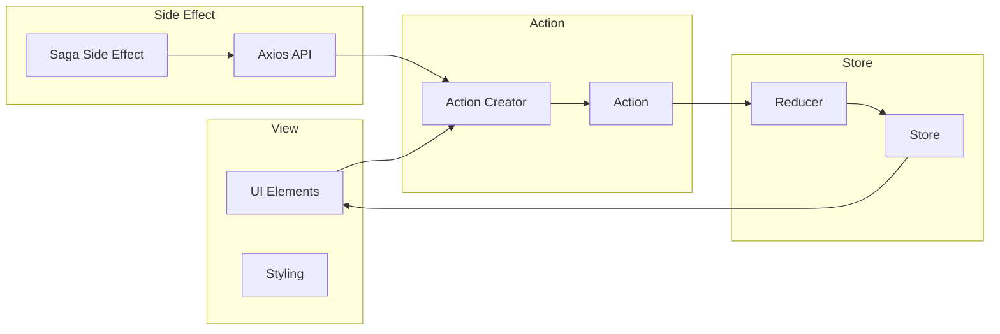

# ProjectName

## Tech Stack

- typescript
- yarn
- React Native
- styled-components
- reduxjs/toolkit

## Architecture

The project follows a component-based architecture, with reusable components being used throughout the application.

## Coding Convention

The project follows the typescript style guide, with ESLint + Prettier being used to enforce the conventions.

## Tool Set

The following tools are used in the project:

- Visual Studio Code
- Android Studio
- Xcode
- Git

## Environment

The project is developed and tested on the following environment:

- iOS: sdk >=12, xcode 14.3, cocoapods 1.12.1
- android sdk: target 33, build tools: 33.0.1, java 11.0.16.1
- Node.js v19.7.0, >= v16
- npm v9.5.0
- yarn v1.22.17
- react: 18.2.0 => 18.2.0
- react-native: 0.71.11 => 0.71.11
- gem: ruby v3.0.3, >= 2.6.10

## Git flow

The project follows the Git flow workflow, with feature branches being created off the develop branch and merged back into it once completed.

- check .githooks folder:
  [x] pre-commit: linter
  [ ] pre-commit: branch-name
  [x] commit-msg

- check .gitlab-ci.yml:
  [x] linter
  [ ] typescript check
  [ ] test

## Build and Deploy

### ProjectName build flavor and scheme

- iOS:
- android:

### Using Bitrise

[]

### Using fastlane

[]
